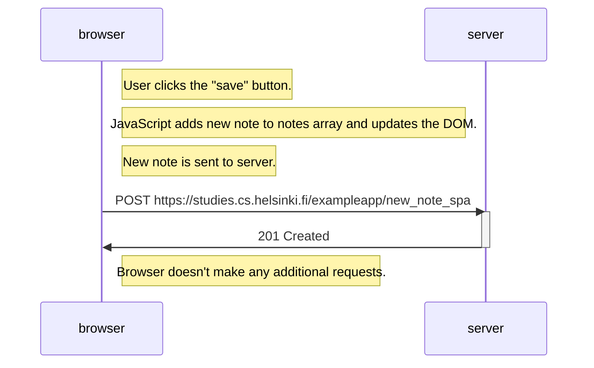

```mermaid
sequenceDiagram
    participant browser
    participant server

    Note right of browser: User clicks the "save" button.

    Note right of browser: JavaScript adds new note to notes array and updates the DOM.

    Note right of browser: New note is sent to server.

    browser->>server: POST https://studies.cs.helsinki.fi/exampleapp/new_note_spa
    activate server
    server->>browser: 201 Created
    deactivate server

    Note right of browser: Browser doesn't make any additional requests.
```